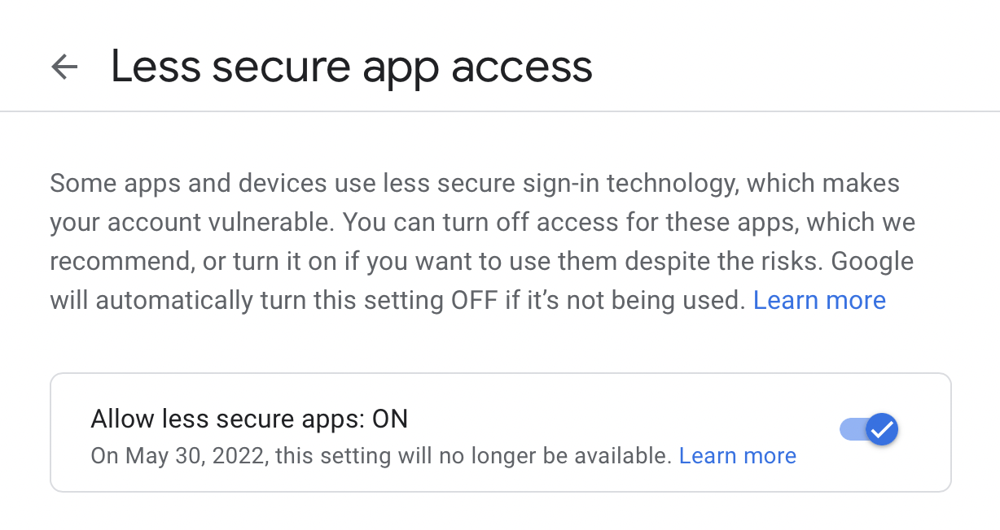
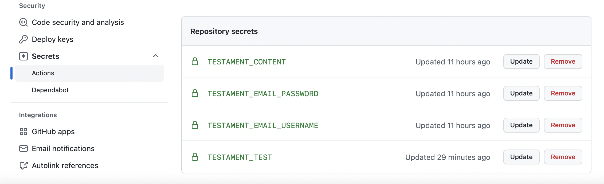

# testament
Send Messages after Death - Make a personal will (testament) sender using github actions.

<br />

## Introduction
In this project, we will check your live status with your Github activities. If your github activity was less than one due to your configuration, it will automatically send a message to your subscription list via email.
<br />
This message can be your will (testament).

<br />

## How to use
- Fork this repoistory

- Create a new email in Gmail
- Set `Less secure app access` is `on`

**Note** You can click on *[this link](https://myaccount.google.com/lesssecureapps)*.

- Set Repository secrets (Repository setting)
  - `TESTAMENT_EMAIL_USERNAME` : Your testament email address
  - `TESTAMENT_EMAIL_PASSWORD` : Your testament email password
  - `TESTAMENT_CONTENT` : Your testament content
  - `TESTAMENT_TEST` : This secret is used in test.php



- Edit subscribers.json (Your subscribers)
```
{
  "emails":[
    "amirsh.nll@gmail.com",
    "eriktt666@gmail.com"
  ]
}
```

- Edit config.php (Your personal configuration)
```
# config
define("YOUR_GITHUB_ID", "amirshnll"); # your github id
define("YOUR_NAME", "Amir Shokri"); # for mail subject
define("DEATH_BOUND", 90); # day
define("MIN_COMMIT_PER_DAY", 1); # times per day
define("SUBSCRIBERS_FILE", "subscribers.json");
```
**note:** If you do not have any daily github actions on your repositories, set the MINI_COMMIT_PER_DAY option to zero.

- Congratulations, you now have a personal will (testament) sender.

<br />


## Contribute
- Don't change **config.php** and **subscribers.json**
